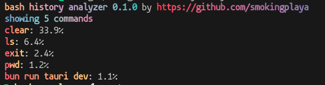

# Bash History Analyzer
A command line tool that shows the ratios of executed commands in bash.



# Installation
```bash
/bin/bash -c "$(curl -fsSL https://raw.githubusercontent.com/smokingplaya/bashhistory/HEAD/install.sh)"
```

# Using
```bash
bashhistory <commands count, default = 10>

bashhistory # shows 10 commands
bashhistory 33 # shows 33 commands
```